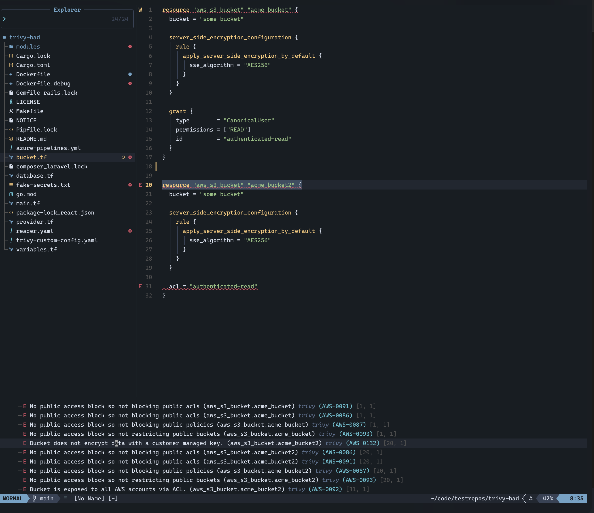

# trivy-ls

> [!NOTE]
> While I previously worked on Trivy and the official VS Code extension, this is not endorsed by or linked to Aqua Security or the Trivy OSS Team. The Language Server will drive whatever version of Trivy you have installed

A [Language Server Protocol](https://microsoft.github.io/language-server-protocol/) server for [Trivy](https://github.com/aquasecurity/trivy). It scans your workspace and reports misconfigurations, secrets and vulnerabilities as editor diagnostics, in any editor with an LSP client.

Built on [go-lsp](https://github.com/owenrumney/go-lsp).




## Contents

- [What it does](#what-it-does)
- [Installation](#installation)
- [Configuration](#configuration)
- [Editor setup](#editor-setup)
  - [VS Code](#vs-code)
  - [Neovim](#neovim)
  - [Helix](#helix)
  - [Vim / coc.nvim](#vim--cocnvim)
  - [Emacs](#emacs)
  - [Sublime Text](#sublime-text)
  - [JetBrains IDEs](#jetbrains-ides)
  - [Zed](#zed)
- [How scanning works](#how-scanning-works)

## What it does

| Feature | Behaviour |
|---|---|
| **Diagnostics** | Misconfigurations, secrets and vulnerabilities published per file |
| **Hover** | Full description, resolution and advisory link for findings on the hovered line |
| **Code actions** | Insert a `trivy:ignore` comment, add the check to `.trivyignore`, open the advisory |
| **Commands** | `trivy-ls.scan`, `trivy-ls.addToIgnoreFile`, `trivy-ls.openUrl` |
| **Progress** | `$/progress` notifications while a scan runs |
| **Live config** | Settings can be changed via `workspace/didChangeConfiguration` without a restart |

Severities map onto LSP as: `CRITICAL`/`HIGH` → error, `MEDIUM` → warning, `LOW` → information, `UNKNOWN` → hint.

## Installation

`trivy-ls` shells out to the `trivy` binary, so install that first:

```bash
# see https://trivy.dev/latest/getting-started/installation/
curl -sfL https://raw.githubusercontent.com/aquasecurity/trivy/main/contrib/install.sh | sh -s -- -b /usr/local/bin
```

Then install the server. **VS Code users can skip this** — the extension bundles the matching binary, so [installing it](#vs-code) is all that's needed.

```bash
go install github.com/owenrumney/trivy-ls/cmd/trivy-ls@latest
```

Or download a binary for your platform from the [releases page](https://github.com/owenrumney/trivy-ls/releases). If you used `go install`, make sure `$(go env GOPATH)/bin` is on your `PATH`. Check it works:

```bash
trivy-ls --version
```

## Configuration

All options are optional. Pass them as `initializationOptions` (preferred) or via `workspace/didChangeConfiguration`. Both a bare object and one nested under a `trivy` key are accepted, since clients differ.

| Option | Type | Default | Description |
|---|---|---|---|
| `trivyPath` | string | `trivy` | Path to the Trivy binary |
| `scanners` | string[] | `["misconfig","secret","vuln"]` | Passed to `--scanners` |
| `severities` | string[] | all | Passed to `--severity`, e.g. `["HIGH","CRITICAL"]` |
| `ignoreFile` | string | `.trivyignore` | Passed to `--ignorefile` |
| `configFile` | string | — | Passed to `--config` |
| `extraArgs` | string[] | — | Appended to the Trivy command line verbatim |
| `scanOnSave` | bool | `true` | Rescan the workspace when a file is saved |
| `scanOnOpen` | bool | `true` | Scan the workspace once at startup |
| `fullRange` | bool | `false` | Underline a finding's whole span instead of just its first line |

> **First run may be slow.** The `vuln` scanner downloads Trivy's vulnerability database (~50 MB) on first use. Drop it from `scanners` if you only care about IaC and secrets — misconfig and secret scanning are entirely offline.

> **`fullRange`** is off by default because IaC findings routinely cover an entire resource block, and a twenty-line squiggle is harder to read than a single underlined line.

## Editor setup

### VS Code

Install the **Trivy Language Server** extension from the Marketplace or Open VSX. It bundles the matching `trivy-ls` binary for your platform, so Trivy itself is the only other thing you need.

Settings live under the `trivy-ls.` prefix and mirror the table above, plus `trivy-ls.serverPath` to point at your own build of the server:

```jsonc
{
  "trivy-ls.scanners": ["misconfig", "secret"],
  "trivy-ls.severities": ["HIGH", "CRITICAL"],
  "trivy-ls.fullRange": false
}
```

Two commands are contributed: **Trivy LS: Scan Workspace** and **Trivy LS: Restart Language Server**.

The extension is deliberately minimal — findings go to the Problems panel and the editor gutter, with hover details and ignore quick fixes. It has no tree view. If you want the tree view, or Aqua Platform integration, use the [official Trivy extension](https://github.com/aquasecurity/trivy-vscode-extension) instead.

> **Running both extensions together** is supported but redundant: each runs its own scan and both publish diagnostics, so every finding appears twice. This extension namespaces its settings and commands `trivy-ls.` rather than `trivy.` precisely so the two can coexist without clashing.

### Neovim

Neovim 0.11+, no plugins needed:

```lua
vim.lsp.config['trivy_ls'] = {
  cmd = { 'trivy-ls' },
  root_markers = { '.git', '.trivyignore', 'main.tf' },
  filetypes = { 'terraform', 'hcl', 'yaml', 'json', 'dockerfile' },
  init_options = {
    scanners = { 'misconfig', 'secret' },
  },
}

vim.lsp.enable('trivy_ls')
```

With `nvim-lspconfig` on older versions:

```lua
local configs = require('lspconfig.configs')
local lspconfig = require('lspconfig')

configs.trivy_ls = {
  default_config = {
    cmd = { 'trivy-ls' },
    filetypes = { 'terraform', 'hcl', 'yaml', 'json', 'dockerfile' },
    root_dir = lspconfig.util.root_pattern('.git', '.trivyignore'),
    init_options = { scanners = { 'misconfig', 'secret' } },
  },
}

lspconfig.trivy_ls.setup({})
```

This runs alongside `terraform-ls` or `yamlls` — Neovim merges diagnostics from every attached server.

### Helix

In `~/.config/helix/languages.toml`:

```toml
[language-server.trivy-ls]
command = "trivy-ls"
config = { scanners = ["misconfig", "secret"] }

[[language]]
name = "hcl"
language-servers = ["terraform-ls", "trivy-ls"]

[[language]]
name = "yaml"
language-servers = ["yaml-language-server", "trivy-ls"]

[[language]]
name = "dockerfile"
language-servers = ["docker-langserver", "trivy-ls"]
```

Helix passes `config` through as `initializationOptions`.

### Vim / coc.nvim

In `:CocConfig`:

```json
{
  "languageserver": {
    "trivy": {
      "command": "trivy-ls",
      "filetypes": ["terraform", "hcl", "yaml", "json", "dockerfile"],
      "rootPatterns": [".git", ".trivyignore"],
      "initializationOptions": {
        "scanners": ["misconfig", "secret"]
      }
    }
  }
}
```

### Emacs

With `eglot`:

```elisp
(add-to-list 'eglot-server-programs
             '((terraform-mode yaml-mode dockerfile-mode) . ("trivy-ls")))
```

With `lsp-mode`, register it as an add-on so it runs alongside your primary server:

```elisp
(lsp-register-client
 (make-lsp-client
  :new-connection (lsp-stdio-connection '("trivy-ls"))
  :major-modes '(terraform-mode yaml-mode dockerfile-mode)
  :add-on? t
  :server-id 'trivy-ls
  :initialization-options (lambda () '(:scanners ["misconfig" "secret"]))))
```

### Sublime Text

With the [LSP](https://packagecontrol.io/packages/LSP) package, in `LSP.sublime-settings`:

```json
{
  "clients": {
    "trivy-ls": {
      "enabled": true,
      "command": ["trivy-ls"],
      "selector": "source.terraform | source.yaml | source.json | source.dockerfile",
      "initializationOptions": {
        "scanners": ["misconfig", "secret"]
      }
    }
  }
}
```

### JetBrains IDEs

IntelliJ IDEA, GoLand and friends have no user-facing way to add an arbitrary LSP server out of the box. Install the [LSP4IJ](https://plugins.jetbrains.com/plugin/23257-lsp4ij) plugin, then add a **New Language Server** with:

- **Command**: `trivy-ls`
- **File name patterns**: `*.tf`, `*.yaml`, `*.yml`, `Dockerfile*`
- **Configuration → Initialization options**: `{"scanners": ["misconfig", "secret"]}`

### Zed

Zed only launches language servers provided by an extension — there's no settings key for an arbitrary binary. Running `trivy-ls` in Zed means writing a small [Zed extension](https://zed.dev/docs/extensions/languages#language-servers) that returns `trivy-ls` from its `language_server_command`. There isn't one published yet.

## How scanning works

Trivy scans a **workspace**, not a buffer, and takes seconds rather than milliseconds. That shapes the design:

- Scans run on a background goroutine. A request arriving mid-scan queues at most one follow-up, so holding down save doesn't stampede the binary.
- Scans are triggered at startup, on save, on `workspace/didChangeConfiguration`, and by the `trivy-ls.scan` command. There is no scan-on-keystroke — Trivy reads from disk, so it would see stale content anyway.
- After each scan the server clears diagnostics for files that had findings previously but no longer do, so fixed findings disappear.
- Findings for targets that aren't real files under the workspace root — Trivy's synthetic `.` target, or downloaded Terraform modules — are dropped, since they can't carry a diagnostic.
- Checks that assert the *absence* of something (`No HEALTHCHECK defined`, `Image user should not be 'root'`) carry no line number from Trivy, so they're reported against line 1 of the file.

### Ignoring findings

Two code actions are offered on any finding:

- **Ignore on this line** inserts a `#trivy:ignore:<ID>` comment above the offending line, matching its indentation. Not offered for JSON, which has no comment syntax, or for findings with no line to anchor to.
- **Ignore workspace-wide** appends the check ID to `.trivyignore` (creating it if needed) and rescans.

## Development

```bash
make build     # build to bin/trivy-ls
make test      # unit tests plus end-to-end tests against a fixture workspace
make lint      # golangci-lint
```

The VS Code client lives in `vscode-trivy-ls/`:

```bash
make extension                                   # cross-compile and package every platform .vsix
make extension-target VSCE_TARGET=darwin-arm64   # just one platform
make extension-install                           # build for this platform and install into VS Code
```

Each `.vsix` is platform-specific and carries a single server binary in `bin/`, so the extension never downloads anything at runtime.

The end-to-end tests boot a real server over an in-memory pipe and scan `internal/handler/testdata/workspace`. They skip automatically if `trivy` isn't installed.

To inspect the LSP traffic while developing, start the server with the debug UI:

```bash
trivy-ls --debug-ui localhost:9000
```

## Licence

MIT
